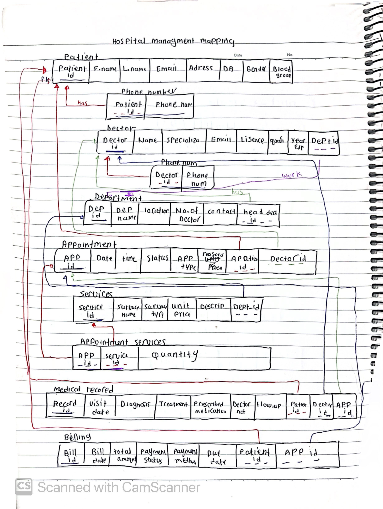

# Hospital Management System - Mapping Diagram

This project represents the mapping process from the ERD (Entity Relationship Diagram) into relational database schemas for a Hospital Management System.

## Description

The ERD was transformed into relational tables using database mapping rules.

## Entities

- Patient
- Doctor
- Department
- Appointment
- Service
- Appointment_Service
- Medical_Record
- Billing

## Database Concepts Used

- Primary Keys (PK)
- Foreign Keys (FK)
- Composite Primary Keys
- Many-to-Many Relationships
- One-to-Many Relationships
- Derived Attributes

## Important Notes

- Age is a derived attribute from DOB and is not stored.
- Appointment_Service is an associative entity used to resolve the many-to-many relationship between Appointment and Service.

## Mapping Diagram

